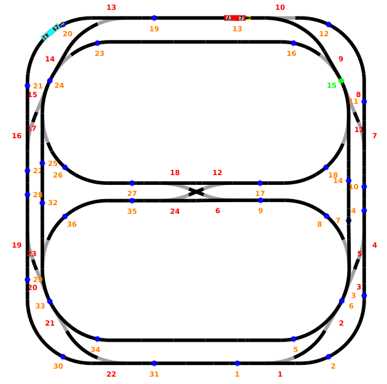

# Laboratoire 4 - Simulateur de trains <!-- omit from toc -->

Calum Quinn - Urs Behrmann

## Table des matières

- [Table des matières](#table-des-matières)
- [Introduction au problème](#introduction-au-problème)
- [Choix d'implémentation](#choix-dimplémentation)
  - [Priorisation](#priorisation)
  - [Zone commune](#zone-commune)
  - [Capteurs de position](#capteurs-de-position)
  - [Attente en gare](#attente-en-gare)
  - [Inversion](#inversion)
- [Tests effectués](#tests-effectués)
  - [Priorisation](#priorisation-1)
  - [Attente en gare](#attente-en-gare-1)
  - [Arrêt d'urgence](#arrêt-durgence)

## Introduction au problème

Le but de ce laboratoire est d'implémenter l'accès concurrent dans un cas réel. La gestion concerne un tronçon commun entre deux trains. Il est donc important d'implémenter correctement la gestion de la zone pour éviter des collisions entre les trains et des attentes inutiles.

Le projet est séparé en 2 parties. La première représente la mise en place de la gestion basique de la zone partagée. La deuxième amène un nouvel aspect de priorité qui change la gestion de quel train rentre à quel moment dans la zone commune.

## Choix d'implémentation

### Priorisation

Lorsque les deux trains arrivent en même temps à la zone partagée et que ceux-ci ont la même priorité, le premier arrivé doit passer.
Nous avons décidé de choisir le premier arrivé au moment du passage sur le point de contact d'acceptation et non au moment du request.
Cette approche permet au train réellement prêt à s’engager dans la zone de le faire en premier. Le deuxième attendra donc au point d'acceptation.

### Zone commune

La zone partagée peut être placée n'importe où entre deux aiguillages. Nous l'avons positionné tout en haut entre les aiguillages 13 et 10.
Un train commence sur la boucle extérieure et l'autre sur la boucle intérieur. Nous avons donc fait un contrôle de quel train va entrer dans la zone commune pour choisir l'orientation des aiguillages d'entrée et de sortie.
La détection du train est faite en comparant le numéro retourné par la classe `Locomotive` avec les valeurs écrits en dur dans le main. Ceci pourrait être amélioré en implémentant la détection du train au moment du passage sur un point de contact.

*Train 42 bleu qui attend que le 7 rouge sorte de la zone partagée*

### Capteurs de position

Pour détecter l'entrée et la sortie dans la zone commune il faut choisir des points de contacts suffisamment proche de la zone pour bloquer la plus petite zone possible.
Nous n'avons néanmoins pas choisi les points juste avant la zone à cause du fait que les trains ont une distance non nulle de freinage. Si nous détectons l'arrivée sur le dernier point avant la zone, les trains s'arrêtent dans la zone et peuvent avoir une collision même en étant arrêté.
Pour le programme 2 nous avons placé le point d'acceptation au même endroit que le point du programme 1, le point de requête est donc le point juste avant.

Les points de sortie peuvent eux être positionné directement après la zone commune comme ça dès la sortie d'un train on peut autoriser l'entrée de l'autre.

### Attente en gare

Pour la gestion de l'attente en gare nous utilisons une sémaphore et une variable partagée. Comme demandé, lorsque le premier train arrive il attend l'arrivée du deuxième, ils attendent ensuite 2sec et ensuite ils repartent.
Plutôt que de faire une attente des deux threads séparément, nous faisons attendre 2sec le thread du deuxième arrivé et seulement après on débloque le premier en faisant un release sur la sémaphore. Ceci permet de faire un appel système de moins pour le premier thread.

### Inversion

Une fois que les trains ont fini leur attente en gare ils doivent repartir en sens inverse. Sinon complique la détection et gestion de l'entrée et sortie en zone commune.
Nous passons donc en paramètre au `LocomotiveBehavior` un double des points de détection request, accept et sortie pour gérer la détection en sens inverse.
Pour les raisons soulevées avant concernant la distance de freinage, il n'est pas possible d'utiliser les points de sortie pour faire la détection à l'entrée de la zone lorsque le train arrive depuis l'autre côté.

## Tests effectués

Tous les tests ont été effectués dans les deux sens de marche pour garantir que les contrôles sont identiques.

### Priorisation

Selon les règles de priorités, nous avons testés différentes situation pour la décision de quel train passe en zone partagée en premier.
Pour ça nous avons pu fabriquer manuellement les situations en employant la mise en attente des trains individuellement.

Nous avons testé les situations lorsque les deux trains se trouvent en même temps entre le point de requête et d'acceptation pour vérifier que c'est à chaque fois le bon train qui est arrêté avant la zone.

Nous avons aussi contrôlé que si un train arrive tout seul à la zone commune qu'il soit bien autoriser à rentrer immédiatement sans devoir freiner. Ceci vérifie aussi la réinitialisation des contrôles effectués lorsqu'un train a déjà passé la validation pour éviter de contrôler des choses du passé.
Ceci inclus aussi le cas où au moment d'arriver à la zone, l'autre train se trouve dans la zone commune, il est donc pas nécessaire de vérifier les autres règles de priorité car il doit de toute façon attendre que l'autre sorte de la zone.

Si les deux trains arrivent en même temps à la zone et que les deux ont la même priorité, c'est bien le premier qui arrive au point d'acceptation qui rentre dans la zone.

### Attente en gare

Nous avons testé que si les deux n'arrivent pas en même temps à la gare que le premier attende le deuxième et ensuite attend encore 2 secondes pendant que l'autre est en gare.
Ceci contrôle aussi que les deux trains partent à chaque fois en même temps de la gare après y avoir passé le temps demandé pour le changement des passagers.

### Arrêt d'urgence

L'arrêt d'urgence a été testé pour vérifier que les deux trains s'arrêtent en même temps et immédiatement. De plus ils ne redémarrent pas, ce qui correspond à nos attentes.

L'arrêt d'urgence a été testé lorsque les trains sont dans toutes les situations possibles:

- En gare
- En train de rouler
- Après le request
- Après l'acceptation
- Dans la zone commune
- En attente de la zone commune

Dans toutes ces situations, les trains s'arrêtent immédiatement et ne repartent pas.

